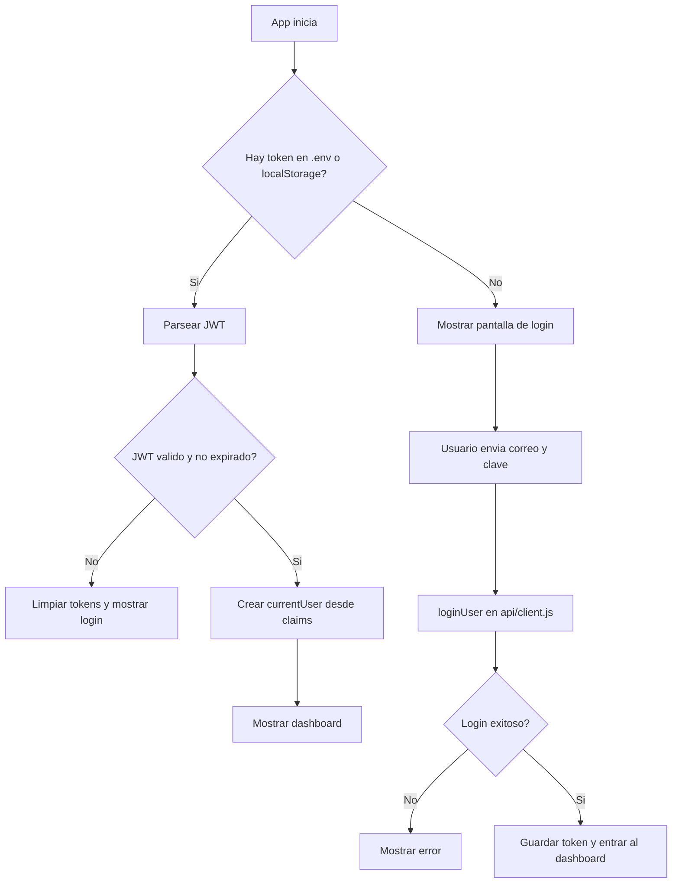
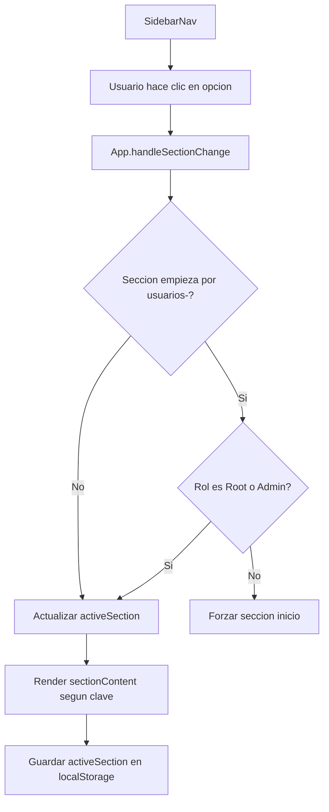
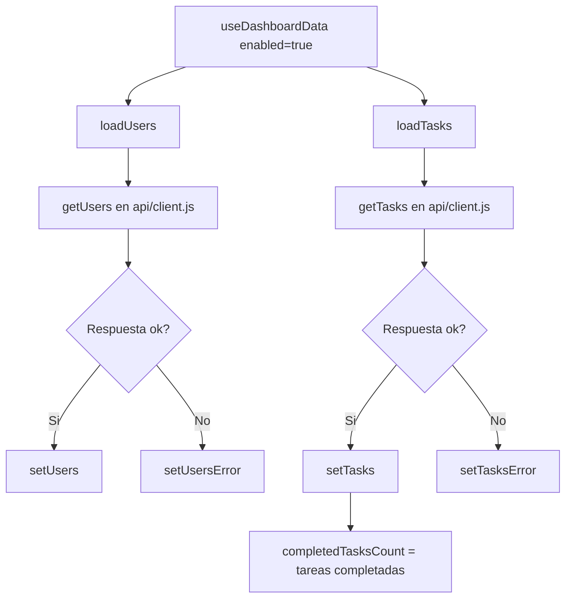
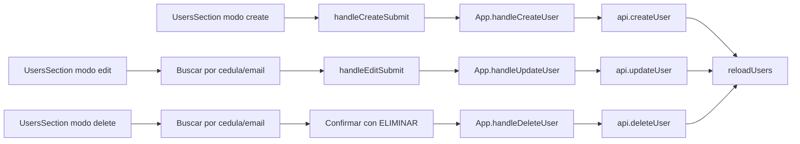
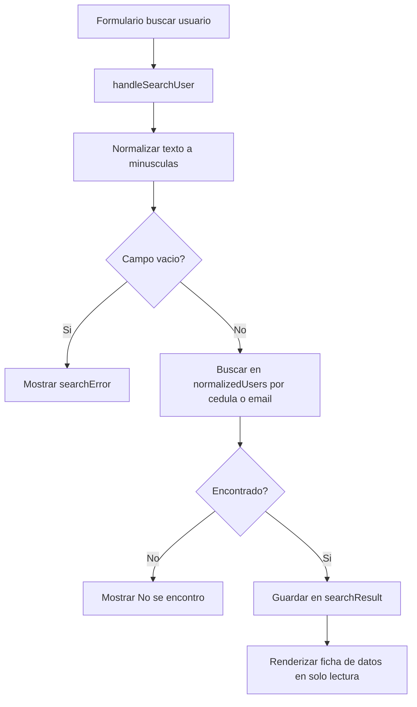
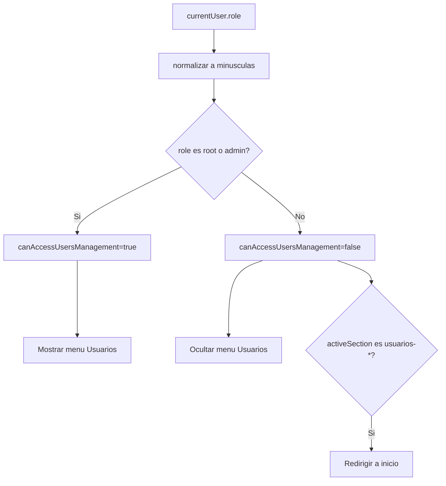
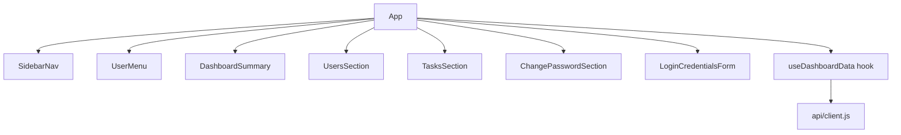

# Frontend React - Gestor de Usuarios y Tareas

Este proyecto es una aplicacion en React + Vite para administrar usuarios y tareas consumiendo una API REST.

Esta documentacion esta pensada para alguien principiante en React. La idea es que puedas entender:

1. Como esta organizado el proyecto.
2. Como fluye la informacion.
3. Que hace cada componente y cada funcion importante.
4. Como correrlo y configurarlo.

## 1) Que tecnologia usa

- React 19
- Vite
- Bootstrap 5 + Bootstrap Icons
- JavaScript moderno (ES modules)

Scripts principales (en package.json):

- npm run dev: levanta servidor de desarrollo.
- npm run build: genera build de produccion.
- npm run preview: previsualiza build.
- npm run lint: revisa reglas de estilo/calidad.

## 2) Estructura general del proyecto

Estructura relevante:

- src/main.jsx
- src/App.jsx
- src/api/client.js
- src/hooks/useDashboardData.js
- src/components/DashboardSummary.jsx
- src/components/SidebarNav.jsx
- src/components/TasksSection.jsx
- src/components/UsersSection.jsx
- src/components/LoginCredentialsForm.jsx
- src/components/UserMenu.jsx
- src/components/ChangePasswordSection.jsx
- src/index.css
- src/App.css

## 3) Flujo principal de la aplicacion

Flujo resumido:

1. main.jsx renderiza App.
2. App valida sesion JWT.
3. Si no hay sesion valida, muestra login.
4. Si hay sesion valida, carga dashboard.
5. useDashboardData trae usuarios y tareas desde la API.
6. El sidebar cambia la seccion activa (inicio, usuarios, tareas, etc).
7. Los componentes de seccion muestran formularios o listas.

## 4) Variables de entorno (.env)

Variables usadas actualmente:

- VITE_API_BASE_URL
- VITE_API_TOKEN
- VITE_AUTH_LOGIN_PATH
- VITE_USERS_CREATE_PATH
- VITE_USERS_UPDATE_PATH
- VITE_CHANGE_PASSWORD_PATH
- VITE_ADMIN_CHANGE_USER_PASSWORD_PATH
- VITE_USERS_DELETE_PATH

Ejemplo actual:

```env
VITE_API_BASE_URL=/api
VITE_API_TOKEN=
VITE_AUTH_LOGIN_PATH=/users/login
VITE_USERS_CREATE_PATH=/users/register
VITE_USERS_UPDATE_PATH=/users
VITE_CHANGE_PASSWORD_PATH=/users/password
VITE_ADMIN_CHANGE_USER_PASSWORD_PATH=/users/password/admin
VITE_USERS_DELETE_PATH=/users
```

## 5) Explicacion archivo por archivo

### src/main.jsx

Responsabilidad: punto de entrada de React.

Que hace:

1. Importa estilos globales y Bootstrap.
2. Importa App.
3. Monta App dentro del elemento root del HTML.

### src/App.jsx

Responsabilidad: componente principal (controla sesion, menu, secciones, permisos y layout).

#### Constantes y helpers en App.jsx

tokenStorageKeys
- Lista de claves donde podria estar guardado el token en localStorage.

activeSectionStorageKey
- Clave para recordar la seccion activa del menu.

clearStoredTokens()
- Elimina token/jwt/access_token/authToken del localStorage.

getStoredToken()
- Busca token en localStorage recorriendo tokenStorageKeys.
- Retorna string vacio si no encuentra.

parseJwtPayload(token)
- Toma un JWT.
- Decodifica su payload (parte central en base64url).
- Lo convierte a objeto JS.
- Si falla, retorna null.

isJwtExpired(payload)
- Revisa claim exp del JWT.
- Retorna true si el token ya expiro.

getValidSessionToken()
- Prioriza VITE_API_TOKEN.
- Si no existe, toma token guardado.
- Valida que sea JWT parseable, no vencido y con usuario interpretable.
- Si no es valido, limpia localStorage y retorna vacio.

getUserFromJwt(payload)
- Extrae nombre y rol de posibles claims del token.
- Soporta distintos nombres de claim (name, username, preferred_username, etc).
- Retorna objeto { name, role } o null.

#### Estado principal en App

activeSection
- Seccion actual del panel.
- Se persiste en localStorage.

isMobileMenuOpen
- Controla el menu lateral en movil (offcanvas).

sessionToken
- Token de sesion activo.

loginError
- Mensaje de error del login.

isSubmittingLogin
- Estado de carga de login.

#### Datos derivados

isAuthenticated
- Booleano basado en si existe sessionToken.

currentUser
- Usuario actual extraido del JWT.

canAccessUsersManagement
- true solo si rol es root o admin.
- Se usa para ocultar/bloquear menu de usuarios.

#### useEffect importantes

Validacion de token
- Si token existe pero es invalido o expiro, se limpia sesion y muestra error.

Bloqueo de scroll en movil
- Si offcanvas esta abierto, agrega overflow-hidden al body.

Persistencia de seccion activa
- Guarda activeSection en localStorage.

Proteccion de secciones de usuarios
- Si el rol no tiene permiso y la seccion empieza por usuarios-, redirige a inicio.

#### Menu y secciones

menuItems (useMemo)
- Define menu inicio/usuarios/tareas.
- Si no tiene permiso Root/Admin, elimina nodo usuarios.

sectionTitles
- Titulo de cabecera para cada clave de seccion.

sectionContent
- Mapa de clave -> componente renderizado.

#### Handlers principales

handleSectionChange(section)
- Cambia seccion activa.
- Protege acceso a usuarios-* para roles no autorizados.

handleLogout()
- Limpia token.
- Limpia seccion persistida.
- Vuelve a inicio.

handleLogin({ email, password })
- Valida campos basicos.
- Llama loginUser (API client).
- Guarda token en estado.

handleCreateUser(...)
- Llama createUser y luego reloadUsers.

handleUpdateUser(...)
- Llama updateUser y luego reloadUsers.

handleDeleteUser(...)
- Llama deleteUser y luego reloadUsers.

handleChangeUserPassword(...)
- Cambia password de otro usuario (admin/root).
- Usa endpoint de .env y query params cedula/email.

handleChangePassword(...)
- Cambia password del usuario autenticado.

renderBrand(compact)
- Renderiza bloque de marca/logo.

renderSidebarInstitutionalInfo()
- Renderiza bloque institucional en footer del sidebar.

#### Render final

Caso 1: no autenticado
- Muestra pantalla de login (layout de marca + formulario).

Caso 2: autenticado
- Muestra header movil, sidebar, topbar, menu de usuario y contenido de seccion.

### src/api/client.js

Responsabilidad: capa de comunicacion con backend.

Define:

- Lectura de variables .env.
- Construccion de headers con token.
- Parseo de respuestas y errores.
- Funciones CRUD de usuarios.
- Login y extraccion de token.

#### Helpers internos

mapRoleToBackendCode(role)
- Convierte Root/Admin/User/Invited a codigo numerico si aplica.

firstNonEmptyString(values)
- Devuelve el primer string no vacio.

extractTokenFromResponse(responseData)
- Intenta extraer token desde varias estructuras posibles de respuesta.

getStoredToken()
- Busca token en localStorage.

parseResponseBody(response)
- Lee respuesta como texto y trata de parsear JSON.

request(path)
- Request generica GET con header Authorization si hay token.
- Maneja errores comunes.

#### Funciones exportadas

getUsers()
- GET /users.

getTasks()
- GET /tasks.

createUser(payload)
- POST usando varios formatos de body para compatibilidad de backend.
- Maneja errores 400/401/403/404/409.

updateUser(payload)
- PUT a USERS_UPDATE_PATH con query params (cedula/email) segun datos.
- Valida que cedula/telefono/rol sean numericos cuando corresponde.
- Maneja 400/401/403/404/405/409.

deleteUser({ userId, cedula, email })
- Intenta varias rutas DELETE para compatibilidad:
	- /users/:id
	- /users?cedula=...
	- /users?email=...
	- /users?userId=...
- Excelente para backends con convenciones diferentes.

loginUser({ email, password })
- POST login con varios formatos de body (email, username, userName, correo).
- Si login responde token valido, lo guarda en localStorage.

### src/hooks/useDashboardData.js

Responsabilidad: hook custom para cargar usuarios y tareas del dashboard.

Estado interno:

- users, tasks
- isLoadingUsers, isLoadingTasks
- usersError, tasksError

Funciones:

loadUsers()
- Consulta usuarios con getUsers.

loadTasks()
- Consulta tareas con getTasks.

useEffect principal
- Si enabled=false, limpia todo y no consulta.
- Si enabled=true, dispara ambas cargas.

completedTasksCount (useMemo)
- Cuenta cuantas tareas tienen completed === true.

Retorna:

- Datos, estados de carga/error, completedTasksCount, reloadUsers.

### src/components/LoginCredentialsForm.jsx

Responsabilidad: formulario de inicio de sesion.

Estado:

- email
- password

Detalles:

- Guarda ultimo email en localStorage (login_last_email).
- handleSubmit evita recarga de pagina y llama onSubmit del padre.

### src/components/SidebarNav.jsx

Responsabilidad: menu lateral con grupos expandibles.

Estado:

- expandedGroups: que grupos estan abiertos.

Funciones:

handleGroupClick(item)
- Alterna grupo abierto/cerrado.
- Si abres grupo nuevo, navega al primer submenu.

useEffect
- Si cambia activeSection, abre automaticamente grupo padre.

### src/components/DashboardSummary.jsx

Responsabilidad: tarjetas resumen en pantalla de inicio.

Recibe props:

- usersCount
- tasksCount
- completedTasksCount

Renderiza 3 cards con icono + valor + etiqueta.

### src/components/TasksSection.jsx

Responsabilidad: render de lista de tareas.

Flujo:

1. Si carga: mensaje Cargando tareas.
2. Si error: mensaje rojo.
3. Si vacio: mensaje informativo.
4. Si hay datos: lista con titulo y estado completada/pendiente.

### src/components/UserMenu.jsx

Responsabilidad: menu desplegable del usuario (topbar).

Estado:

- isOpen

Refs:

- menuRef para detectar click fuera.

Funciones:

renderAvatar()
- Muestra inicial del nombre.

useEffect click outside
- Cierra el menu si clickeas fuera del panel.

Acciones:

- Cambiar mi contraseña.
- Cerrar sesion.

### src/components/ChangePasswordSection.jsx

Responsabilidad: formulario para cambiar contraseña del usuario autenticado.

Estado:

- currentPassword
- newPassword
- confirmPassword
- isSubmitting
- error
- success

handleSubmit(event)
- Evita submit nativo.
- Valida campos, confirmacion y longitud minima.
- Llama onChangePassword del padre.

### src/components/UsersSection.jsx

Responsabilidad: componente grande multiproposito para todo el modulo de usuarios.

Modos soportados por prop mode:

- list
- create
- edit
- search
- change-password
- delete

Estado interno (resumen):

- Formularios de crear.
- Formularios de editar.
- Flujo de buscar.
- Flujo de borrar.
- Flujo de cambiar password de otro usuario.

Funciones clave:

keepOnlyDigits(value)
- Elimina caracteres no numericos.

normalizedUsers (useMemo)
- Normaliza estructura de usuario para tolerar respuestas distintas del backend.

handleCreateSubmit
- Valida y dispara creacion.

handleFindUserToEdit
- Busca usuario por cedula o email.

handleEditSubmit
- Guarda cambios del usuario editado.

handleSearchUser
- Busca y muestra datos de usuario (solo lectura).

handleFindUserToDelete
- Busca usuario para preparar confirmacion de borrado.

handleDeleteSubmit
- Exige palabra ELIMINAR y ejecuta borrado.

Inline submit en modo change-password
- Primer form: busca usuario por cedula/email.
- Segundo form: valida nueva password y llama onChangeUserPassword.

Render segun modo:

- create: formulario completo de alta.
- edit: buscar + form editable.
- delete: buscar + confirmacion fuerte.
- change-password: buscar + nueva clave.
- search: buscar + ficha solo lectura.
- list: tarjetas de usuarios.

## 6) CSS (vision general)

src/index.css
- Estilos globales base (tipografia, body, root).

src/App.css
- Estilos visuales de toda la interfaz:
	- sidebar
	- cards
	- formularios
	- avatar/menu usuario
	- bloques institucionales
	- responsive

## 7) Reglas de permisos implementadas

Actualmente el modulo Usuarios esta restringido en frontend:

- Solo roles Root o Admin ven el menu Usuarios y sus submenus.
- Si un rol no autorizado intenta abrir una seccion usuarios-*, App lo envia a inicio.

Importante:
- Esta proteccion de frontend mejora UX, pero la seguridad real debe estar tambien en backend.

## 8) Como ejecutar el proyecto (paso a paso)

1. Instala dependencias:

```bash
npm install
```

2. Revisa .env y endpoints.

3. Inicia en desarrollo:

```bash
npm run dev
```

4. Compila para produccion:

```bash
npm run build
```

5. (Opcional) previsualiza build:

```bash
npm run preview
```

## 9) Consejos para empezar a modificar sin romper

1. Empieza por App.jsx para entender navegacion y sesion.
2. Luego revisa useDashboardData.js para ver de donde vienen datos.
3. Despues entra a UsersSection.jsx por partes (modo list, luego create, luego edit).
4. Si cambias endpoints, ajusta primero .env y luego client.js.
5. Prueba siempre con npm run build para detectar errores rapido.

## 10) Glosario rapido para principiantes

- Componente: funcion que devuelve UI (JSX).
- Prop: dato que un componente padre le pasa a uno hijo.
- Estado (useState): datos internos del componente que pueden cambiar.
- Efecto (useEffect): codigo que corre cuando cambian dependencias.
- Hook custom: funcion reutilizable con logica de estado/efectos (ej: useDashboardData).
- JSX: sintaxis parecida a HTML dentro de JavaScript.

---

Si quieres, en un siguiente paso te puedo generar una version 2 de este README con diagramas de flujo (login, CRUD usuarios y navegacion), para que te sea aun mas facil aprender React con este mismo proyecto.

## 11) Diagramas de flujo (version visual para principiantes)

### 11.1 Flujo de autenticacion



### 11.2 Flujo de navegacion por secciones



### 11.3 Flujo de carga de datos del dashboard



### 11.4 Flujo CRUD de usuarios (vista general)



### 11.5 Flujo buscar usuario (submenu buscar)



### 11.6 Flujo de permisos para menu Usuarios



### 11.7 Mapa mental rapido de componentes



## 12) Apendice: ejemplos JSON de request/response

Nota importante para principiante:

- Estos ejemplos son una guia.
- Tu backend puede usar nombres de campos diferentes.
- Este frontend ya intenta adaptarse a varios formatos (sobre todo en login y crear usuario).

### 12.1 Login

Endpoint (segun .env):

- POST /users/login

Request comun:

```json
{
	"email": "admin@demo.com",
	"password": "123456"
}
```

Request alternativo que este frontend tambien prueba:

```json
{
	"username": "admin@demo.com",
	"password": "123456"
}
```

Response posible 1 (token plano):

```json
"eyJhbGciOiJIUzI1NiIsInR5cCI6IkpXVCJ9..."
```

Response posible 2 (objeto):

```json
{
	"token": "eyJhbGciOiJIUzI1NiIsInR5cCI6IkpXVCJ9..."
}
```

Errores comunes:

- 401: credenciales invalidas.
- 404: ruta de login no existe.

### 12.2 Listar usuarios

Endpoint:

- GET /users

Response ejemplo:

```json
[
	{
		"id": 1,
		"nombres": "Juan",
		"apellidos": "Perez",
		"cedula": "12345678",
		"telefono": "3001234567",
		"email": "juan@demo.com",
		"role": "Admin"
	}
]
```

Nota:
- El frontend tambien soporta alias como userId, _id, firstName, lastName, document, phone, correo, roleId.

### 12.3 Listar tareas

Endpoint:

- GET /tasks

Response ejemplo:

```json
[
	{
		"id": 101,
		"title": "Configurar entorno",
		"completed": true
	},
	{
		"id": 102,
		"title": "Crear formulario de usuarios",
		"completed": false
	}
]
```

### 12.4 Crear usuario

Endpoint (segun .env):

- POST /users/register

Request ejemplo:

```json
{
	"nombres": "Laura",
	"apellidos": "Gomez",
	"cedula": "98765432",
	"telefono": "3105551212",
	"email": "laura@demo.com",
	"password": "123456",
	"role": 1
}
```

Response ejemplo:

```json
{
	"message": "Usuario creado correctamente",
	"userId": 25
}
```

Errores comunes:

- 400: datos invalidos.
- 409: usuario ya existe.
- 401/403: sin permisos.

### 12.5 Editar usuario

Endpoint base (segun .env):

- PUT /users

Este frontend envia query params con cedula/email, por ejemplo:

- PUT /users?cedula=98765432&email=laura%40demo.com

Request ejemplo:

```json
{
	"nombres": "Laura",
	"apellidos": "Gomez",
	"cedula": 98765432,
	"telefono": 3105551212,
	"email": "laura@demo.com",
	"role": 1
}
```

Response ejemplo:

```json
{
	"message": "Usuario actualizado"
}
```

### 12.6 Buscar usuario (en frontend)

Importante:

- El submenu Buscar usuario no llama endpoint propio.
- Busca localmente en el arreglo de usuarios ya cargado por GET /users.

Entrada de busqueda:

```json
{
	"lookup": "98765432"
}
```

Resultado encontrado (en estado interno del componente):

```json
{
	"userId": 25,
	"nombres": "Laura",
	"apellidos": "Gomez",
	"cedula": "98765432",
	"telefono": "3105551212",
	"email": "laura@demo.com",
	"role": "Admin"
}
```

### 12.7 Cambiar contraseña del usuario autenticado

Endpoint (segun .env):

- PUT /users/password

Request ejemplo:

```json
{
	"currentPassword": "123456",
	"newPassword": "654321"
}
```

Response ejemplo:

```json
{
	"message": "Contraseña actualizada"
}
```

### 12.8 Cambiar contraseña de otro usuario (admin/root)

Endpoint (segun .env):

- PUT /users/password/admin?cedula=98765432&email=laura%40demo.com

Request ejemplo:

```json
{
	"cedula": "98765432",
	"email": "laura@demo.com",
	"newPassword": "abc12345"
}
```

Response ejemplo:

```json
{
	"message": "Contraseña del usuario actualizada"
}
```

### 12.9 Eliminar usuario

Endpoint base (segun .env):

- DELETE /users

Estrategias que intenta el frontend:

1. DELETE /users/:id
2. DELETE /users?cedula=...&email=...
3. DELETE /users?cedula=...
4. DELETE /users?email=...
5. DELETE /users?userId=...

Response ejemplo:

```json
{
	"message": "Usuario eliminado"
}
```

## 13) Checklist rapido para depurar API

Si algo no funciona, revisa en este orden:

1. Que VITE_API_BASE_URL apunte al backend correcto.
2. Que el backend este encendido.
3. Que tengas token valido (login exitoso).
4. Que la ruta exacta exista en backend.
5. Que el rol tenga permisos (Root/Admin para modulo usuarios).
6. Que los nombres de campos coincidan con los esperados.
